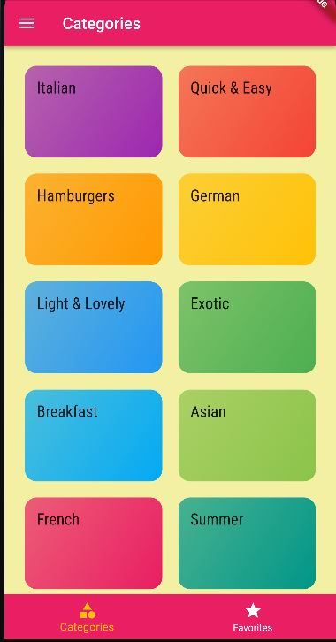

# MEALS_APP

This is a small flutter learning side project. In this app you find a list of meals catagorized and you can navigate to each meal to learn what the ingredients are and the steps how to prepare them. There is also an option where you can save your favorite meals.

# Screenshot of Page

# Built With

- Flutter

## Authors

👤 **Samuel Teweldebrhan Ghebremeskel**

- Github: [@githubhandle](https://github.com/Samitti)
- Twitter: [@twitterhandle](https://twitter.com/Samuel63734232)
- Linkedin: [linkedin](https://www.linkedin.com/in/samuelghebremeskel/)

## 🤝 Contributing

Contributions, issues and feature requests are welcome!

Feel free to check the [issues page](https://github.com/Samitti/MEALS-APP/issues).

## Show your support

Give a ⭐️ if you like this project!
